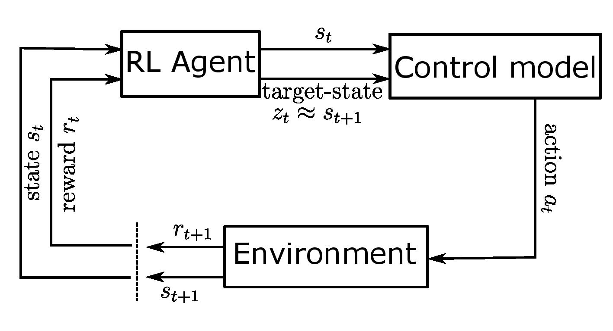
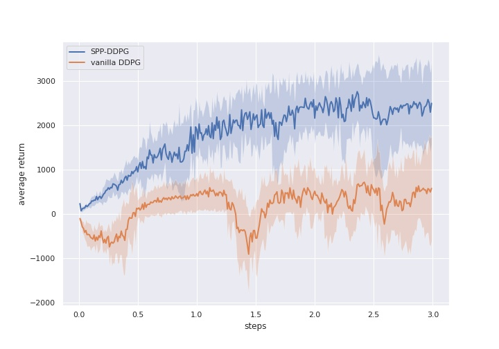
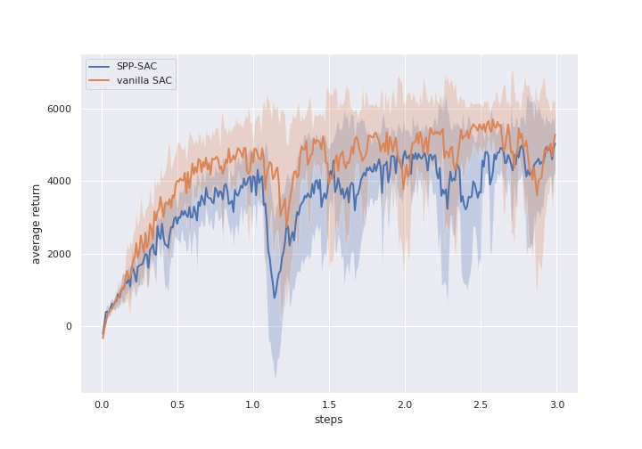
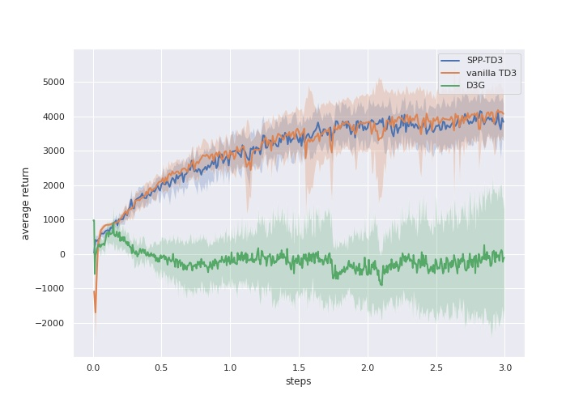
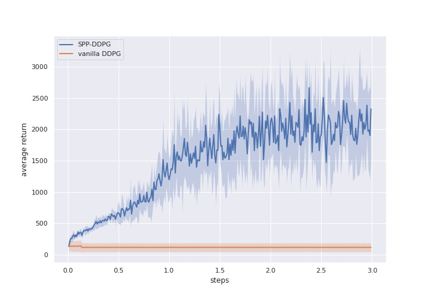
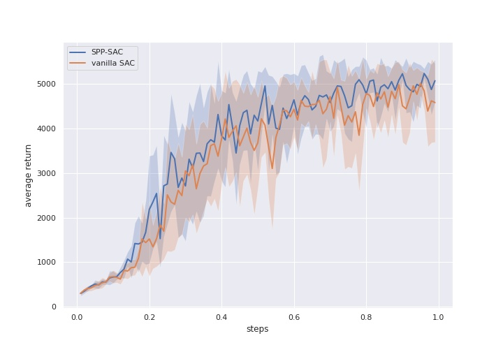
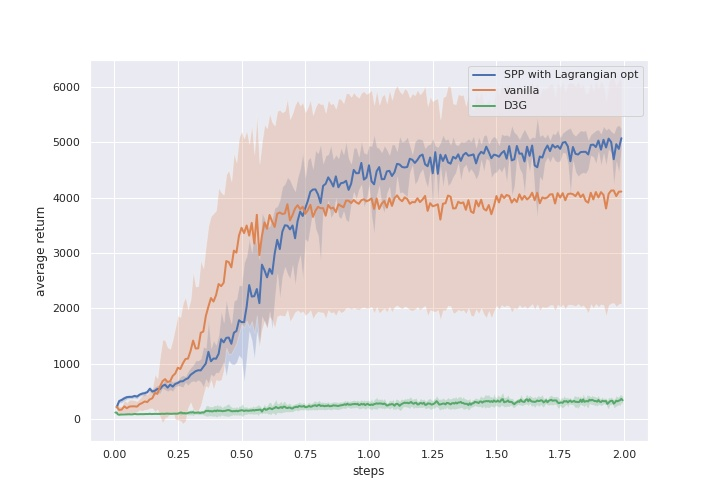
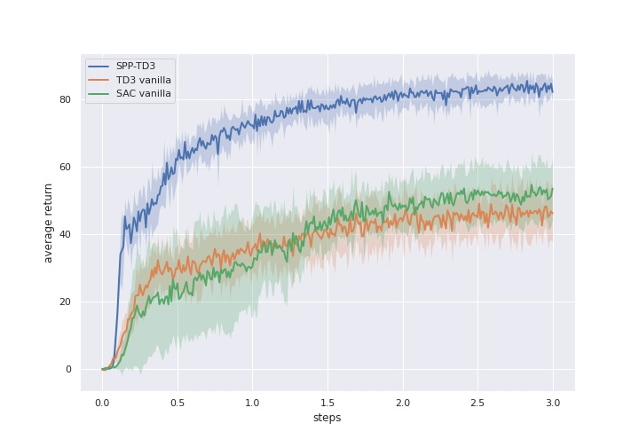
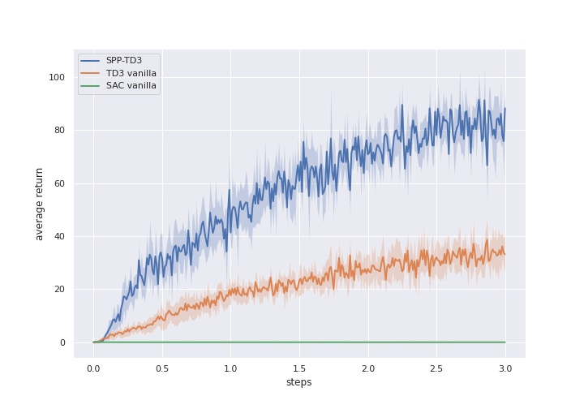
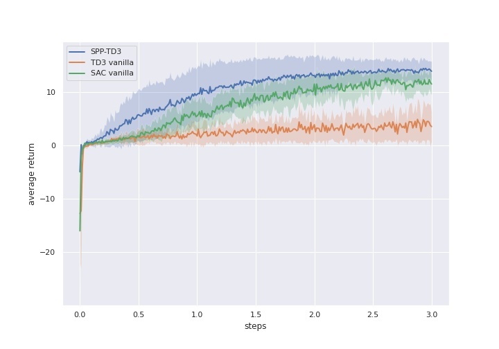

# Software and Results for the *State Planning Policy Reinforcement Learning* Paper

This repository is the official implementation of the State Planning Policy Reinforcement Learning.  

You can find videos presenting the trained agents online [https://sites.google.com/view/spprl](https://sites.google.com/view/spprl)



## Requirements

Code was run on Ubuntu 20.04 Ubuntu 20.4 install notes

1. download mujoco200 linux https://www.roboti.us/index.html and put into .mujoco directory with licence
add following line to .bashrc
```
export LD_LIBRARY_PATH=$LD_LIBRARY_PATH:(path to .mujoco)/mujoco200/bin
```
2. install mujoco-py requirements
```
sudo apt install cmake
sudo apt install libosmesa6-dev libgl1-mesa-glx libglfw3
```
3. install patchelf
```
sudo add-apt-repository ppa:jamesh/snap-support
sudo apt-get update
sudo apt install patchelf
```

4. 
```
cd rltoolkit
```
```
pip install -r requirements.txt
```

Requirements will install mujoco-py which will work only on installed mujoco with licence (see **Install MuJoCo** section in [mujoco-py documentation](https://github.com/openai/mujoco-py))

Then install `rltoolkit` with:
```rltoolkit install
pip install -e rltoolkit/
```

## Training

To train the models in the paper, you can use scripts from `train` folder.
We provide a separate script per environment class.

### MuJoCo
To train SPP-TD3 on Ant, simply run:

```train
python run_experiment.py td3 Ant --spp -c configs/spp_td3_optimal_mujoco.yaml
```

SPP-SAC can be run by replacing `td3` with `sac`, and using the config file
`configs/spp_sac_optimal_mujoco.yaml`

to run Humanoid instead of `Ant` can be replaced with `Humanoid`.

Analogously, to train vanilla TD3 on Ant (remove `--spp` and change the config file) run:
```train
python run_experiment.py td3 Ant -c configs/td3_base.yaml
```

Our running script accepts several other useful parameters,
including `--n_runs` how many runs, `--n_cores` how many cores use in parallel.

Also [neptune.ai](https://neptune.ai) logging can be used by providing `--neptune_proj` project name and `--neptune_token` token. 

### SafetyGym

To train SPP-TD3 on Doggo Goal, simply run:

```train
python run_experiment.py td3 Goal Doggo --spp -c configs/spp_td3_optimal_safetygym.yaml
```

To run `Doggo Button` instead of `Goal` replace `Goal` with `Button`, proceed similarly for Doggo Columns and Car Push.

To train vanilla TD3/SAC on Doggo Goal run (for `SAC` replace `td3` with `sac`):

```train
python run_experiment.py td3 Goal Doggo -c configs/td3_base.yaml
```

Our running script accepts several other useful parameters,
including `--n_runs` how many runs, `--n_cores` how many cores use in parallel.

Also [neptune.ai](https://neptune.ai) logging can be used by providing `--neptune_proj` project name and `--neptune_token` token. 

### AntPush

To train SPP-TD3 on AntPush, simply run:

```train
python run_experiment.py td3 AntPush --spp -c configs/spp_td3_optimal_antpush.yaml
```

Other algorithms and environments were not tested.

## Pre-trained Models

You can find pre-trained models in `models` directory and a notebook for evaluating them will be provided shortly.

## Results

Our model achieves the following performance on [OpenAI gym MuJoCo environments](https://gym.openai.com/envs/#mujoco):

Ant results:

<p float="left">



</p>

Humanoid results:

<p float="left">



</p>

Our model achieves the following performance on [OpenAI safety-gym environments](https://github.com/openai/safety-gym):

Doggo-Goal results:



Doggo-Button results: 



Car-Push results:




